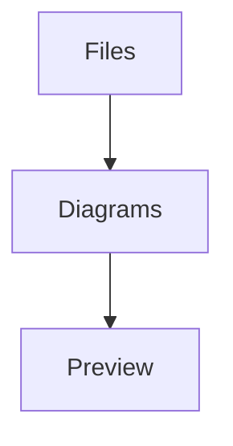

# Sample project

This prose surrounds two independently editable Mermaid diagrams.



Keep this paragraph and the ordinary code fence unchanged when editing a diagram.

```typescript
const message = 'Surrounding source remains unchanged'
```

~~~mermaid
stateDiagram-v2
  [*] --> Clean
  Clean --> Dirty: Edit
  Dirty --> Clean: Save
~~~

This final paragraph must also survive every diagram save.
